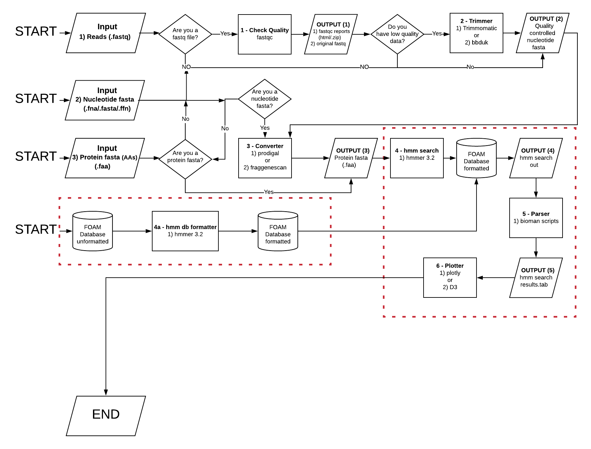

# RoboMax: python code for versatile Functional Ontology Assignments for Metagenomes via Hidden Markov Model (HMM) searching with environmental focus of shotgun meta'omics data
================================================

- awesome software for hmm search

Installing RoboMax: 
-------
- needs a pip installer
- needs a conda installer
- needs source installer
- MAYBE A gpu down the road

Usage examples:
------
- Add examples 
- Add Workflows

Main options (some from mercat):
-----
 * -i I        path-to-input-file
 * -f F        path-to-folder-containing-input-files
 * -n N        no of cores [default = all]
 * -pro        run protein input file specified as ['.faa']
 * -q          tell that input file provided are raw nucleotide sequence reads as ['.fq, .fastq']
 * -p          run prodigal on nucleotide assembled contigs. Must be one of ['.fa', '.fna', '.ffn', '.fasta']
 * -t [T]      Trimmomatic options
 * -h, --help  show this help message

Step 0 - Input formats:
-----
- From any NextGen sequencing technology (from Illumina, Pacbio, Oxford Nanopore)
- type 1 raw reads (.fastq format)
- type 2 nucleotide fasta (.fasta, .fa, .fna, .ffn format), assembled raw reads into contigs
- type 3 protein fasta (.faa format), assembled contigs which genes are converted to amino acid sequence 

Step 1 - Check Quality: (only for .fastq files)
-----
- painfully in java (ugh!?!)
`fastqc file.fastq`
https://www.bioinformatics.babraham.ac.uk/projects/fastqc/

Step 2 - Trimmer: (only for .fastq files)
-----
- From mercat (www.github.com/raw937/mercat) 
- painfully in java (ugh!?!)
-t [T]      Trimmomatic options
https://github.com/timflutre/trimmomatic
http://www.usadellab.org/cms/index.php?page=trimmomatic
- This is for Illumina data only, we will have to look into it for PacBio and Nanopore

In the future 
- bbduk or other trimmer

Step 3 - Converter: (nucleotide fasta from reads or contigs):
-----
- From mercat (www.github.com/raw937/mercat) 
https://github.com/hyattpd/Prodigal
 * -p          run prodigal on nucleotide assembled contigs. Must be one of ['.fa', '.fna', '.ffn', '.fasta']
 
In the future
- look at OrfM http://github.com/wwood/OrfM
- fraggenescanPlus https://github.com/hallamlab/FragGeneScanPlus/wiki

Step 4 - Hmmer search: 
-------
- hmmer search http://hmmer.org/download.html
`hmmsearch --domtblout XXX.faa.FOAM.out FOAM-hmm_rel1a.hmm XXX.faa`

Step 4a - hmmer db formatter: 
-------
In the future custom hmms, and we need to rebuild FOAM as an update

Step 5 - parsing out from hmmer:
-------
`sort XXX.faa.FOAM.out > XXX.faa.FOAM.out.sort`  
`python bmn-HMMerBestHit.py XXX.faa.FOAM.out.sort > XXX.faa.FOAM.out.sort.BH`  
`awk '{print $4}' XXX.faa.FOAM.out.sort.BH > XXX.faa.FOAM.out.sort.BH.tmp1`  
`python bmn-CountEachElement.py XXX.faa.FOAM.out.sort.BH.tmp1 > XXX.faa.FOAM.out.sort.BH.tmp2`  
`python bmn-KOoneCount.py XXX.faa.FOAM.out.sort.BH.tmp2 | sed s/KO://g | sort -k 1 > XXX.faa.FOAM.out.sort.BH.KO`  

Step 6 - Plotting data:
-------
- plotly or D3

Citing RoboMax
-------------
 RoboMax: python code for versatile Functional Ontology Assignments for Metagenomes via Hidden Markov Model (HMM) searching with environmental focus of shotgun meta'omics data. PeerJ Preprints. 

CONTACT
-------
The informatics point-of-contact for this project is [Dr. Richard Allen White III](https://github.com/raw937). 
If you have any questions or feedback, please feel free to get in touch by email. 
Dr. Richard Allen White III - raw937@gmail.com.   
Or [open an issue](https://github.com/raw937/robomax/issues).
