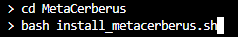
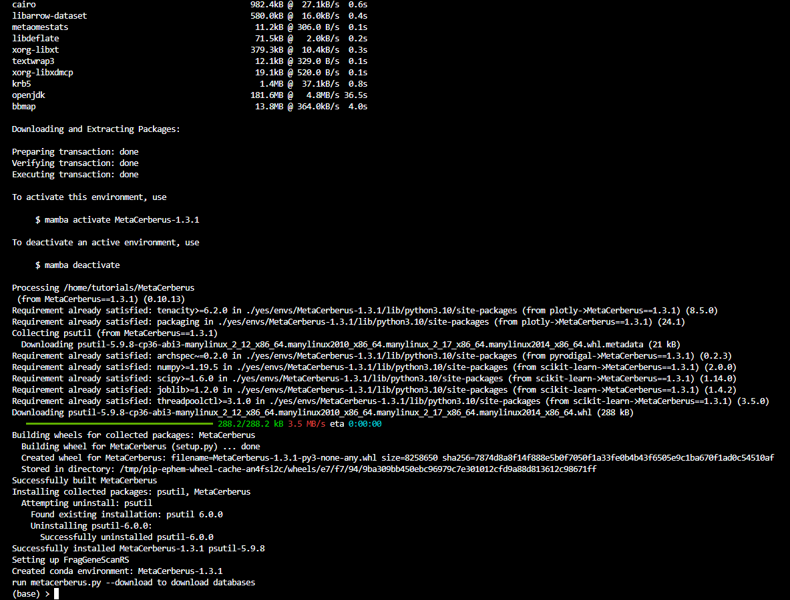
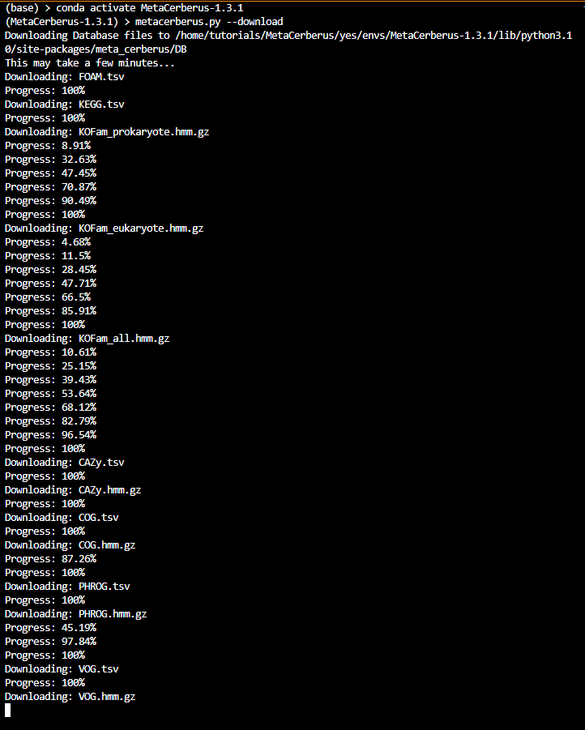

MetaCerberus Tutorial - Installation
=======================================

STEP 0: Installation
--------------------------
Windows/Ubuntu
~~~~~~~~~~~~~~~

Installing MetaCerberus 1.3 manually due to Mamba/Conda issue (Newest Version)

These are the commands you will use to install MetaCerberus:
::

  git clone https://github.com/raw-lab/MetaCerberus.git 
  cd metacerberus
  bash install_metacerberus.sh
  conda activate MetaCerberus-1.3.0
  metacerberus.py --download

After the ``git clone http://github.com/raw-lab/MetaCerberus.git`` command, you will see:

.. image:: ../img/Gitclone_result_install.jpg
    :width: 600

Then proceed to next part of command:

This command will result in installation of MetaCerberus, which looks like this once completed:

Then we'll activate MetaCerberus, followed by downloaded the appropriate databases, like so:

.. image:: ../img/metacerberus.py_--download.jpg
    :width: 600

Which will look like: 

Now you're ready to run MetaCerberus!