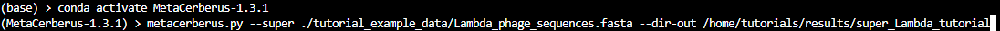
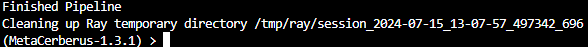

Running MetaCerberus - Tutorial
==================================

Once you have installation complete, databases are downloaded, and you've already ran ``conda activate MetaCerberus-1.3.1``, it's time to run MetaCerberus. This tutorial gives an example run through using a fasta file of the complete Lambda phage genome. 

Step 1: Initializing the Pipeline
---------------------------------------

.. tip:: Know where your input file(s) are and where you want to place your results folder. If ``--dir-out /path/to/results/folder`` is not used, then MetaCerberus defaults to creating a results folder in the directory where ``metacerberus.py`` was ran.

Here's the command I'm using to run the Lambda phage genome:

- I'm using ``--super /path/to/input/file`` so that MetaCerberus will run both FragGeneScan and Prodigal on this file. 
- ``--dir-out`` is used to tell MetaCerberus where to output the results. 

A detailed list of options for MetaCerberus can be found `here`_.

.. _here: https://metacerberus.readthedocs.io/en/latest/page7.html#

Once you have your command prepared, let's run MetaCerberus. After you enter your command, the pipeline output looks like so:

.. image:: ../img/pipeline_look.jpg
    :width: 1400
    :height: 600
Once finished, the bottom of your prompt screen will show:

