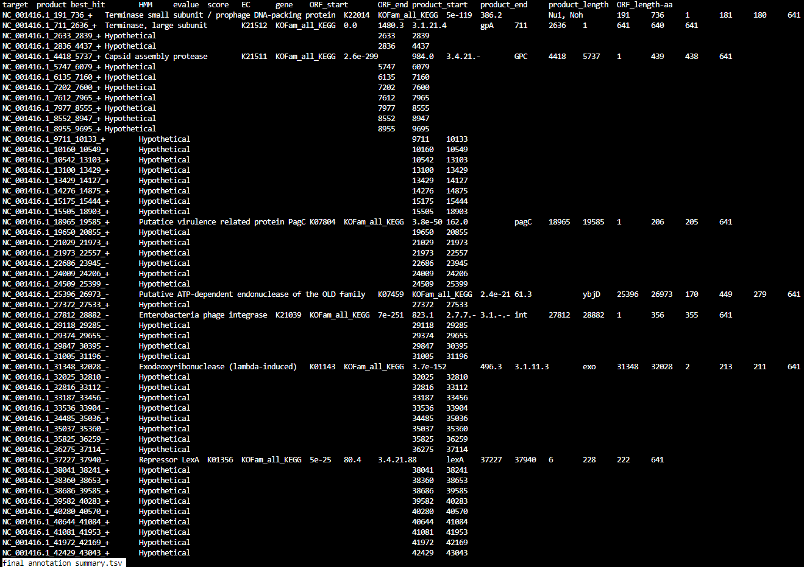
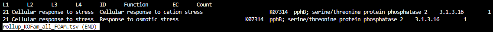
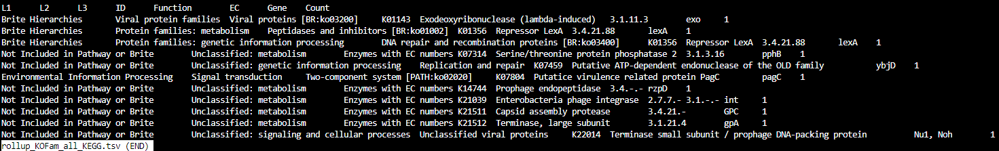

MetaCerberus Tutorial - What's in the Results folder? 
=========================================================

Now that we've run the MetaCerberus pipeline, let's take a look at the results folder. Having ran the ``--super`` option on my data, the results folder looks like so:

.. image:: ../img/results_folder.jpg
    :width: 2200

Now a closer look at each subdirectory of our results:

Step_5-format:
-------------------

.. image:: ../img/step_5_outputs.jpg
    :width: 600

Step 5 contents only consist of a ``complete`` file, which merely indicates Step 5 ran to completion.

Step_6-metaomeQC
-------------------
Here are the contents of ``step_06-metaomeQC``:
~~~~~~~~~~~~~~~~~~~~~~~~~~~~~~~~~~~~~~~~~~~~~~~~~~
.. image:: ../img/S6_contents.jpg
    :width: 600

The file ``read-stats.txt`` contains statistics for your input file, like so:

.. image:: ../img/step6-read-stats-txt.jpg
    :scale: 107%

.. note:: The file ``stderr.out`` is a log file where any error messages will be stored.

Step_7-geneCall
-------------------
Contents of the ``step_07-geneCall`` directory are:
~~~~~~~~~~~~~~~~~~~~~~~~~~~~~~~~~~~~~~~~~~~~~~~~~~~~~
.. image:: ../img/Step7_contents.jpg
    :width: 700

These are protein files in different formats. 

Step_8-hmmer
------------------
Contents of the ``step_08-hmmer`` directory are:
~~~~~~~~~~~~~~~~~~~~~~~~~~~~~~~~~~~~~~~~~~~~~~~~~~~~

.. image:: ../img/Step8_contents.jpg
    :width: 2000
    :height: 100
For your MetaCerberus run, you should get a subdirectory for the mode that MetaCerberus used (FragGeneScan, Prodigal, Prodigalgv, etc).
In this example run, we have several file outputs for FragGeneScan. The types of outputs are similar for prodigal.
* Quick link to examples:
    - '``KOFam_all_FOAM-FragGeneScan_Lambda_phage_sequences.tsv``<https://metacerberus.readthedocs.io/en/latest/tutorial3.html#kofam-all-foam-fraggenescan-lambda-phage-sequences-tsv>'_
    - '``KOFam_all_KEGG-FragGeneScan_Lambda_phage_sequences.tsv``<https://metacerberus.readthedocs.io/en/latest/tutorial3.html#kofam-all-kegg-fraggenescan-lambda-phage-sequences-tsv>'_
    - '``filtered-KOFam_all_FOAM.tsv``<https://metacerberus.readthedocs.io/en/latest/tutorial3.html#filtered-kofam-all-foam-tsv>'_
    - '``filtered-KOFam_all_KEGG.tsv``<https://metacerberus.readthedocs.io/en/latest/tutorial3.html#filtered-kofam-all-kegg-tsv>'_
    - '``filtered.tsv``<https://metacerberus.readthedocs.io/en/latest/tutorial3.html#filtered-tsv>'_

This is what they look like:
~~~~~~~~~~~~~~~~~~~~~~~~~~~~~~~~
.. note:: ``.tsv`` files can be opened with Excel. 

``KOFam_all_FOAM-FragGeneScan_Lambda_phage_sequences.tsv``:
^^^^^^^^^^^^^^^^^^^^^^^^^^^^^^^^^^^^^^^^^^^^^^^^^^^^^^^^^^^^^^^^^^^^^^^^^^^^^^^^^^

.. image:: ../img/S8-KOFam_FOAM_FGS_tsv.jpg

``KOFam_all_KEGG-FragGeneScan_Lambda_phage_sequences.tsv``
^^^^^^^^^^^^^^^^^^^^^^^^^^^^^^^^^^^^^^^^^^^^^^^^^^^^^^^^^^^^^^^^

.. image:: ../img/S8-FGS-KOFam-KEGG_tsv.jpg

``filtered-KOFam_all_FOAM.tsv``
^^^^^^^^^^^^^^^^^^^^^^^^^^^^^^^^^^^^^^^^^^^^^^^^^^^^^^^^^^^^^^^^

.. image:: ../img/S8-filtered-KOFam-FOAM_tsv.jpg

``filtered-KOFam_all_KEGG.tsv``
^^^^^^^^^^^^^^^^^^^^^^^^^^^^^^^^^^^^^^^^^^^^^^^^^^^^^^^^^^^^^^^^

.. image:: ../img/S8-filtered-KOFam-allKEGG_tsv.jpg

``filtered.tsv``
^^^^^^^^^^^^^^^^^^^^^^^^^^^^^^^^^^^^^^^^^^^^^^^^^^^^^^^^^^^^^^^^

.. image:: ../img/S8-filtered_tsv.jpg

Step_9-parse
------------------
The contents of ``step_09-parse`` are:
~~~~~~~~~~~~~~~~~~~~~~~~~~~~~~~~~~~~~~~~~

.. image::  ../img/S9_contents.jpg
    :width: 3500
    :height: 80

* Quick link to examples:
    - 'HMMER-KOFam_all_FOAM_top_5.tsv<https://metacerberus.readthedocs.io/en/latest/tutorial3.html#hmmer-kofam-all-foam-top-5-tsv>'_
    - 'HMMER-KOFam_all_KEGG_top_5.tsv<https://metacerberus.readthedocs.io/en/latest/tutorial3.html#hmmer-kofam-all-kegg-top-5-tsv>'_
    - 'HMMER_BH_KOFam_all_FOAM_rollup2.tsv<https://metacerberus.readthedocs.io/en/latest/tutorial3.html#hmmer-bh-kofam-all-foam-rollup2-tsv>'_
    - 'HMMER_BH_KOFam_all_KEGG_rollup2.tsv<https://metacerberus.readthedocs.io/en/latest/tutorial3.html#hmmer-bh-kofam-all-kegg-rollup2-tsv>'_
    - 'HMMER_top_5.tsv<https://metacerberus.readthedocs.io/en/latest/tutorial3.html#hmmer-top-5-tsv>'_
    - 'KOFam_all_FOAM-rollup_counts.tsv<https://metacerberus.readthedocs.io/en/latest/tutorial3.html#kofam-all-foam-rollup-counts-tsv>'_
    - 'KOFam_all_KEGG-rollup_counts.tsv<https://metacerberus.readthedocs.io/en/latest/tutorial3.html#kofam-all-kegg-rollup-counts-tsv>'_
    - 'counts_KOFam_all_FOAM.tsv<https://metacerberus.readthedocs.io/en/latest/tutorial3.html#counts-kofam-all-foam-tsv>'_
    - 'counts_KOFam_all_KEGG.tsv<https://metacerberus.readthedocs.io/en/latest/tutorial3.html#counts-kofam-all-kegg-tsv>'_
    - 'top_5-FragGeneScan_Lambda_phage_sequences.tsv<https://metacerberus.readthedocs.io/en/latest/tutorial3.html#top-5-fraggenescan-lambda-phage-sequences-tsv>'_

Looking a little closer: 
~~~~~~~~~~~~~~~~~~~~~~~~~~~~

``HMMER-KOFam_all_FOAM_top_5.tsv``
^^^^^^^^^^^^^^^^^^^^^^^^^^^^^^^^^^^^^^

.. image:: ../img/S9-HMMR-KOFam_allFOAM_top5_tsv.jpg

``HMMER-KOFam_all_KEGG_top_5.tsv``
^^^^^^^^^^^^^^^^^^^^^^^^^^^^^^^^^^^^^^

.. image:: ../img/S9-HMMR_KOFam_allKEGG_top5_tsv.jpg

``HMMER_BH_KOFam_all_FOAM_rollup2.tsv``
^^^^^^^^^^^^^^^^^^^^^^^^^^^^^^^^^^^^^^^^^

.. image:: ../img/S9-HMMR_BH_KOFam_FOAM_rollup2_tsv.jpg
    :width: 2000
    :height: 75

``HMMER_BH_KOFam_all_KEGG_rollup2.tsv``
^^^^^^^^^^^^^^^^^^^^^^^^^^^^^^^^^^^^^^^^^

.. image:: ../img/S9-HMMR_BH_KOFam_all_KEGG_rollup2_tsv.jpg
    :width: 4000
    :height: 100

``HMMER_top_5.tsv``
^^^^^^^^^^^^^^^^^^^^^^^^^^^^^^^^^^^^^^^^^

.. image:: ../img/S9_HMMR_top_5.tsv.jpg

``KOFam_all_FOAM-rollup_counts.tsv``
^^^^^^^^^^^^^^^^^^^^^^^^^^^^^^^^^^^^^^^^^

.. image:: ../img/S9_KOFam_all_FOAM_rollup_counts_tsv.jpg

``KOFam_all_KEGG-rollup_counts.tsv``
^^^^^^^^^^^^^^^^^^^^^^^^^^^^^^^^^^^^^^^^^

.. image:: ../img/S9-KOFam_allKEGG_rollup_counts_tsv.jpg

``counts_KOFam_all_FOAM.tsv``
^^^^^^^^^^^^^^^^^^^^^^^^^^^^^^^^^^^^^^^^^

.. image:: ../img/S9-counts_KOFam_allFOAM_tsv.jpg

``counts_KOFam_all_KEGG.tsv``
^^^^^^^^^^^^^^^^^^^^^^^^^^^^^^^^^^^^^^^^^

.. image:: ../img/S9-counts_KOFam_all_KEGG_tsv.jpg

``top_5-FragGeneScan_Lambda_phage_sequences.tsv``
^^^^^^^^^^^^^^^^^^^^^^^^^^^^^^^^^^^^^^^^^^^^^^^^^^^^^^^^^^^^^^^^^^^^^^^^^^^^^^^^^^

.. image:: ../img/S9-top5_FGS_tsv.jpg

Step_10-visualizeData
--------------------------

The contents of ``step_10-visualizeData`` are:
~~~~~~~~~~~~~~~~~~~~~~~~~~~~~~~~~~~~~~~~~~~~~~~~~

.. image:: ../img/S10-contents.jpg
    :scale: 160%

What's in the FragGeneScan and Prodigal subdirectories?
~~~~~~~~~~~~~~~~~~~~~~~~~~~~~~~~~~~~~~~~~~~~~~~~~~~~~~~~~~~

.. image:: ../img/S10-FGS-Prod-contents.jpg
    :width: 3000
    :height: 100

Files under FragGeneScan or Prodigal:
~~~~~~~~~~~~~~~~~~~~~~~~~~~~~~~~~~~~~~~~

* Quick link to examples:
    - '``KOFam_all_FOAM_level-1.tsv``<https://metacerberus.readthedocs.io/en/latest/tutorial3.html#kofam-all-foam-level-1-tsv>'_
    - '``KOFam_all_FOAM_level-2.tsv``<https://metacerberus.readthedocs.io/en/latest/tutorial3.html#kofam-all-foam-level-2-tsv>'_
    - '``KOFam_all_FOAM_level-3.tsv``<https://metacerberus.readthedocs.io/en/latest/tutorial3.html#kofam-all-foam-level-3-tsv>'_
    - '``KOFam_all_FOAM_level-4.tsv``<https://metacerberus.readthedocs.io/en/latest/tutorial3.html#kofam-all-foam-level-4-tsv>'_
    - '``KOFam_all_FOAM_level-id.tsv``<https://metacerberus.readthedocs.io/en/latest/tutorial3.html#kofam-all-foam-level-id-tsv>'_
    - '``KOFam_all_KEGG_level-1.tsv``<https://metacerberus.readthedocs.io/en/latest/tutorial3.html#kofam-all-kegg-level-1-tsv>'_
    - '``KOFam_all_KEGG_level-2.tsv``<https://metacerberus.readthedocs.io/en/latest/tutorial3.html#kofam-all-kegg-level-2-tsv>'_
    - '``KOFam_all_KEGG_level-3.tsv``<https://metacerberus.readthedocs.io/en/latest/tutorial3.html#kofam-all-kegg-level-3-tsv>'_
    - '``KOFam_all_KEGG_level-id.tsv``<https://metacerberus.readthedocs.io/en/latest/tutorial3.html#kofam-all-kegg-level-id-tsv>'_
    - '``fasta_stats.txt``<https://metacerberus.readthedocs.io/en/latest/tutorial3.html#fasta-stats-txt>'_
    - '``sunburst_KOFam_all_FOAM.html``<https://metacerberus.readthedocs.io/en/latest/tutorial3.html#sunburst-kofam-all-foam-html-open-in-web-browser>'_
    - '``sunburst_KOFam_all_KEGG.html``<https://metacerberus.readthedocs.io/en/latest/tutorial3.html#sunburst-kofam-all-kegg-html-open-in-web-browser>'_

``KOFam_all_FOAM_level-1.tsv``
^^^^^^^^^^^^^^^^^^^^^^^^^^^^^^^^^^^^^^

.. image:: ../img/S10-KOFam_all_FOAM_level-1_tsv.jpg

``KOFam_all_FOAM_level-2.tsv``
^^^^^^^^^^^^^^^^^^^^^^^^^^^^^^^^^^^^^^

.. image:: ../img/S10-KOFam_all_FOAM_lvl2_tsv.jpg

``KOFam_all_FOAM_level-3.tsv``
^^^^^^^^^^^^^^^^^^^^^^^^^^^^^^^^^^^^^^

.. image:: ../img/S10-KOFam_all_FOAM_lvl3_tsv.jpg

``KOFam_all_FOAM_level-4.tsv``
^^^^^^^^^^^^^^^^^^^^^^^^^^^^^^^^^^^^^^

.. image:: ../img/S10-KOFam_all_FOAM_lvl4_tsv.jpg

``KOFam_all_FOAM_level-id.tsv``
^^^^^^^^^^^^^^^^^^^^^^^^^^^^^^^^^^^^^^

.. image:: ../img/S10_KOFam_all_FOAM_lvl_id_tsv.jpg

``KOFam_all_KEGG_level-1.tsv``
^^^^^^^^^^^^^^^^^^^^^^^^^^^^^^^^^^^^^^

.. image:: ../img/S10-KOFam_all_KEGG_lvl1_tsv.jpg

``KOFam_all_KEGG_level-2.tsv``
^^^^^^^^^^^^^^^^^^^^^^^^^^^^^^^^^^^^^^

.. image:: ../img/S10-KOFam_all_KEGG_lvl2_tsv.jpg

``KOFam_all_KEGG_level-3.tsv``
^^^^^^^^^^^^^^^^^^^^^^^^^^^^^^^^^^^^^^

.. image:: ../img/S10_KOFam_all_KEGG_lvl3_tsv.jpg

``KOFam_all_KEGG_level-id.tsv``
^^^^^^^^^^^^^^^^^^^^^^^^^^^^^^^^^^^^^^

.. image:: ../img/S10_KOFam_all_KEGG_lvl-ID_tsv.jpg

``fasta_stats.txt``
^^^^^^^^^^^^^^^^^^^^^^^^^^^^^^^^^^^^^^

.. image:: ../img/S10_fasta_stats_txt.jpg
    :scale: 107%

``sunburst_KOFam_all_FOAM.html`` --- open in web browser
^^^^^^^^^^^^^^^^^^^^^^^^^^^^^^^^^^^^^^^^^^^^^^^^^^^^^^^^^^^^^^^^^^^^^^^^^^^^

.. image:: ../img/S10_Sunburst_KOFam_all_FOAM_html.jpg
    :width: 1700

``sunburst_KOFam_all_KEGG.html`` --- open in web browser
^^^^^^^^^^^^^^^^^^^^^^^^^^^^^^^^^^^^^^^^^^^^^^^^^^^^^^^^^^^^^^^^^^^^^^^^^^^^

.. image:: ../img/S10_Sunburst_KOFam_all_KEGG_html.jpg
    :width: 1700

Contents under ``combined``:
~~~~~~~~~~~~~~~~~~~~~~~~~~~~~~~~
At a glance:
^^^^^^^^^^^^^^

.. image:: ../img/S10_combined_contents.jpg
    :scale: 150%

* Quick link to examples:
    - '``counts_KOFam_all_FOAM.tsv``<https://metacerberus.readthedocs.io/en/latest/tutorial3.html#id1>'_
    - '``counts_KOFam_all_KEGG.tsv``<https://metacerberus.readthedocs.io/en/latest/tutorial3.html#id2>'_
    - '``stats.html``<https://metacerberus.readthedocs.io/en/latest/tutorial3.html#stats-html-open-in-web-browser>'_
    - '``stats.tsv``<https://metacerberus.readthedocs.io/en/latest/tutorial3.html#stats-tsv>'_
    - '``img`` subdirectory<https://metacerberus.readthedocs.io/en/latest/tutorial3.html#img-contains-the-individual-png-image-files-which-are-collectively-located-in-stats-html>'_

``counts_KOFam_all_FOAM.tsv``    
#############################################

.. image:: ../img/step10-combined-countsKOFamFOAM.jpg

``counts_KOFam_all_KEGG.tsv``
#############################################

.. image:: ../img/S10_combined_counts_KOFam_all_KEGG_tsv.jpg

``stats.html`` --- open in web browser
#############################################

.. image:: ../img/S10_combined_stats_html.jpg
    :width: 1700

``stats.tsv``
#############################################

.. image:: ../img/S10_Stats_tsv.jpg

``img`` --- contains the individual .png image files which are collectively located in ``stats.html``
################################################################################################################

.. image:: ../img/S10_combined_img_contents.jpg
    :width: 3000
    :height: 100

Final
-------------------
The contents of ``final`` are:
~~~~~~~~~~~~~~~~~~~~~~~~~~~~~~~~~

.. image:: ../img/Final_contents.jpg
    :width: 1000
    :height: 35

- There's two ``.gbk`` files which are in GenBank Format.

- The ``./final/fasta`` subdirectory contains .faa, .ffn, and .fna files of FragGeneScan, Prodigal, etc (depending on commands given):
~~~~~~~~~~~~~~~~~~~~~~~~~~~~~~~~~~~~~~~~~~~~~~~~~~~~~~~~~~~~~~~~~~~~~~~~~~~~~~~~~~~~~~~~~~~~~~~~~~~~~~~~~~~~~~~~~~~~~~~~~~~~~~~~~~~~~~~~

    * ``.faa`` - Protein FASTA file of the translated CDS/ORFs sequences
    * ``.ffn`` - FASTA Feature Nucleotide file, the Nucleotide sequence of translated CDS/ORFs.
    * ``.fna`` - Nucleotide FASTA file of the input contig sequences.

.. image:: ../img/Final_fasta_folder.jpg
    :width: 1000
    :height: 50

- The ``./final/gff`` contains .gff and .gtf files:
~~~~~~~~~~~~~~~~~~~~~~~~~~~~~~~~~~~~~~~~~~~~~~~~~~~~~~~

    * ``.gff`` - General Feature Format
    * ``.gtf`` - Gene Transfer Format

.. image:: ../img/Final_gff_folder.jpg
    :scale: 96%

What's in the ``./final/FragGeneScan_<file_name>`` and ``./final/prodigal_<file_name>`` subdirectories?
~~~~~~~~~~~~~~~~~~~~~~~~~~~~~~~~~~~~~~~~~~~~~~~~~~~~~~~~~~~~~~~~~~~~~~~~~~~~~~~~~~~~~~~~~~~~~~~~~~~~~~~~~~~~~~~~~
    .. image:: ../img/Final_contents_expanded_FGS_Prod.jpg
        :scale: 96%

A closer look:
^^^^^^^^^^^^^^^^^^^^^

* Quick link to examples:
    - '``HMMER_top_5.tsv``<https://metacerberus.readthedocs.io/en/latest/tutorial3.html#id3>'_
    - '``annotation_summary_KOFam_all_FOAM.tsv``<https://metacerberus.readthedocs.io/en/latest/tutorial3.html#annotation-summary-kofam-all-foam-tsv>'_
    - '``annotation_summary_KOFam_all_KEGG.tsv``<https://metacerberus.readthedocs.io/en/latest/tutorial3.html#annotation-summary-kofam-all-kegg-tsv>'_
    - '``final_annotation_summary.tsv``<https://metacerberus.readthedocs.io/en/latest/tutorial3.html#final-annotation-summary-tsv>'_
    - '``rollup_KOFam_all_FOAM.tsv``<https://metacerberus.readthedocs.io/en/latest/tutorial3.html#rollup-kofam-all-foam-tsv>'_
    - '``rollup_KOFam_all_KEGG.tsv``<https://metacerberus.readthedocs.io/en/latest/tutorial3.html#rollup-kofam-all-kegg-tsv>'_

``HMMER_top_5.tsv``
#########################

.. image:: ../img/Final_HMMR_top5_tsv.jpg

``annotation_summary_KOFam_all_FOAM.tsv``
#############################################

.. image:: ../img/Final_annotation_summary_KOFam_allFOAM_tsv.jpg

``annotation_summary_KOFam_all_KEGG.tsv``
#############################################

.. image:: ../img/Final_annotation_summary_KOFam_allKEGG_tsv.jpg

``final_annotation_summary.tsv``
#############################################

``rollup_KOFam_all_FOAM.tsv``
#############################################

``rollup_KOFam_all_KEGG.tsv``
#############################################

Everything has crossed over(^^^)!