A Look at the Results folder - Tutorial
=========================================

Now that we've run the MetaCerberus pipeline, let's take a look at the results folder. Having ran the ``--super`` option on my data, the results folder looks like so:

.. image:: ../img/results_folder.jpg
    :width: 600

Now a closer look at each subdirectory of our results:

Step 5 - Format:
-------------------

.. image:: ../img/step_5_outputs.jpg
    :width: 600

Step 5 contents only consist of a ``complete`` file, which merely indicates Step 5 ran to completion.

Step 6 - MetaomeQC
-------------------
Here are the contents of ``step_06-metaomeQC``:

.. image:: ../img/S6_contents.jpg
    :width: 600

The file ``read-stats.txt`` contains statistics for your input file, like so:

.. image:: ../img/step6-read-stats-txt.jpg

.. note:: The file ``stderr.out`` is a log file where any error messages will be stored.

Step 7 - Gene Call
-------------------
Contents of the ``step_07-geneCall`` directory are:

.. image:: ../img/Step7_contents.jpg
    :width: 600

These are protein files in different formats. 

Step 8 - HMMER
------------------
Contents of the ``step_08-hmmer`` directory are:

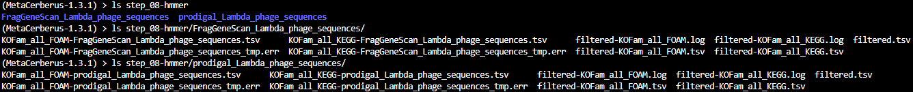

For your MetaCerberus run, you should get a subdirectory for the mode that MetaCerberus used (FragGeneScan, Prodigal, Prodigalgv, etc).
In this example run, we have several file outputs for FragGeneScan. This is what they look like:

.. note:: ``.tsv`` files can be opened with Excel. 

``KOFam_all_FOAM-FragGeneScan_Lambda_phage_sequences.tsv``:

.. image:: ../img/S8-KOFam_FOAM_FGS_tsv.jpg

``KOFam_all_KEGG-FragGeneScan_Lambda_phage_sequences.tsv``

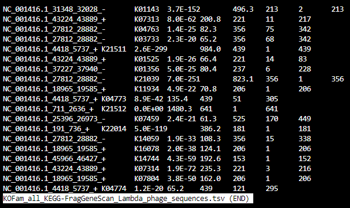

``filtered-KOFam_all_FOAM.tsv``

.. image:: ../img/S8-filtered-KOFam-FOAM_tsv.jpg

``filtered-KOFam_all_KEGG.tsv``

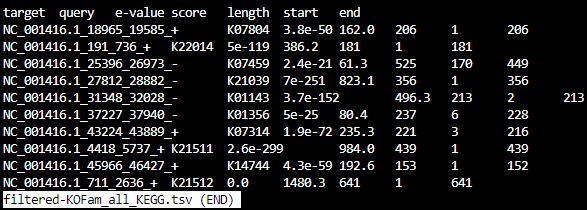

``filtered.tsv``

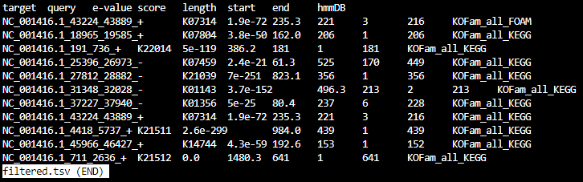

Step 9 - Parse
------------------
The contents of ``step_09-parse`` are:

.. image::  ../img/S9_contents.jpg

Looking a little closer: 

``HMMER-KOFam_all_FOAM_top_5.tsv``

.. image:: ../img/S9-HMMR-KOFam_allFOAM_top5_tsv.jpg

``HMMER-KOFam_all_KEGG_top_5.tsv``

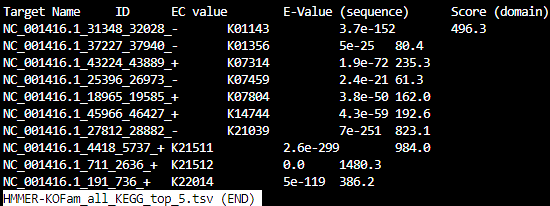

``HMMER_BH_KOFam_all_FOAM_rollup2.tsv``

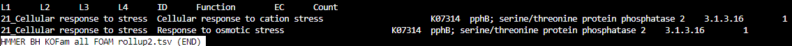

``HMMER_BH_KOFam_all_KEGG_rollup2.tsv``

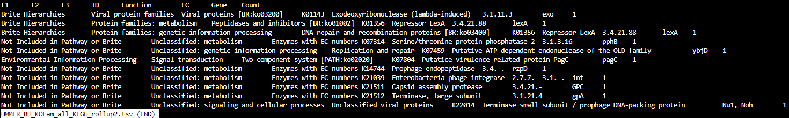

``HMMER_top_5.tsv``

.. image:: ../img/S9_HMMR_top_5.tsv.jpg

``KOFam_all_FOAM-rollup_counts.tsv``

.. image:: ../img/S9_KOFam_all_FOAM_rollup_counts_tsv.jpg

``KOFam_all_KEGG-rollup_counts.tsv``

.. image:: ../img/S9-KOFam_allKEGG_rollup_counts_tsv.jpg

``counts_KOFam_all_FOAM.tsv``

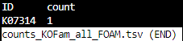

``counts_KOFam_all_KEGG.tsv``

.. image:: ../img/S9-counts_KOFam_all_KEGG_tsv.jpg

``top_5-FragGeneScan_Lambda_phage_sequences.tsv``

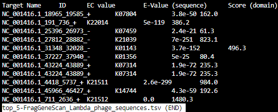

Step 10 - Visualize data
--------------------------

The contents of ``step_10-visualizeData`` are:

.. image:: ../img/S10-contents.jpg

What's in the FragGeneScan and Prodigal subdirectories?

.. image:: ../img/S10-FGS-Prod-contents.jpg

Files under FragGeneScan or Prodigal:
~~~~~~~~~~~~~~~~~~~~~~~~~~~~~~~~~~~~~~~~

``KOFam_all_FOAM_level-1.tsv``

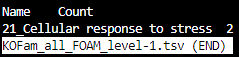

``KOFam_all_FOAM_level-2.tsv``

.. image:: ../img/S10-KOFam_all_FOAM_lvl2_tsv.jpg

``KOFam_all_FOAM_level-3.tsv``

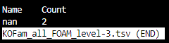

``KOFam_all_FOAM_level-4.tsv``

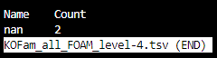

``KOFam_all_FOAM_level-id.tsv``

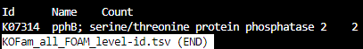

``KOFam_all_KEGG_level-1.tsv``

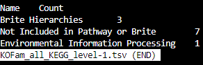

``KOFam_all_KEGG_level-2.tsv``

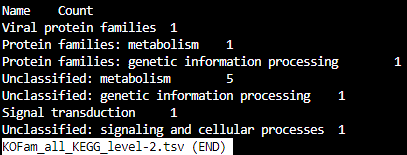

``KOFam_all_KEGG_level-3.tsv``

.. image:: ../img/S10_KOFam_all_KEGG_lvl3_tsv.jpg

``KOFam_all_KEGG_level-id.tsv``

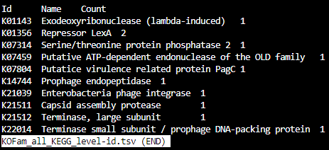

``fasta_stats.txt``

.. image:: ../img/S10_fasta_stats_txt.jpg

``sunburst_KOFam_all_FOAM.html`` --- open in web browser

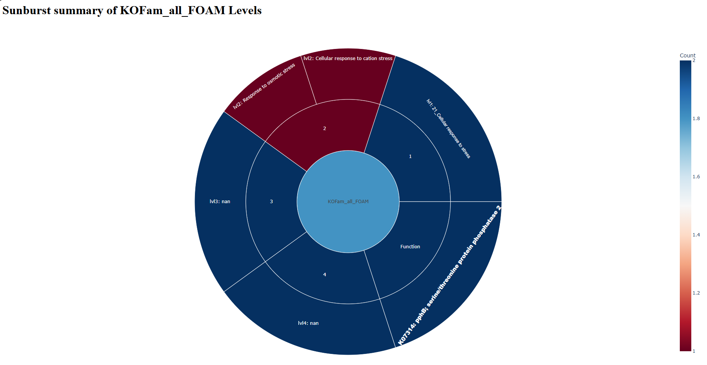

``sunburst_KOFam_all_KEGG.html`` --- open in web browser

.. image:: ../img/S10_Sunburst_KOFam_all_KEGG_html.jpg

Contents under ``combined``:
~~~~~~~~~~~~~~~~~~~~~~~~~~~~~~~~
At a glance:

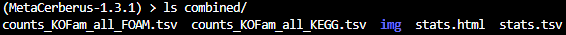

``counts_KOFam_all_FOAM.tsv``    

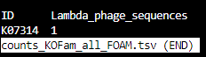

``counts_KOFam_all_KEGG.tsv``

.. image:: ../img/S10_combined_counts_KOFam_all_KEGG_tsv.jpg

``stats.html`` --- open in web browser

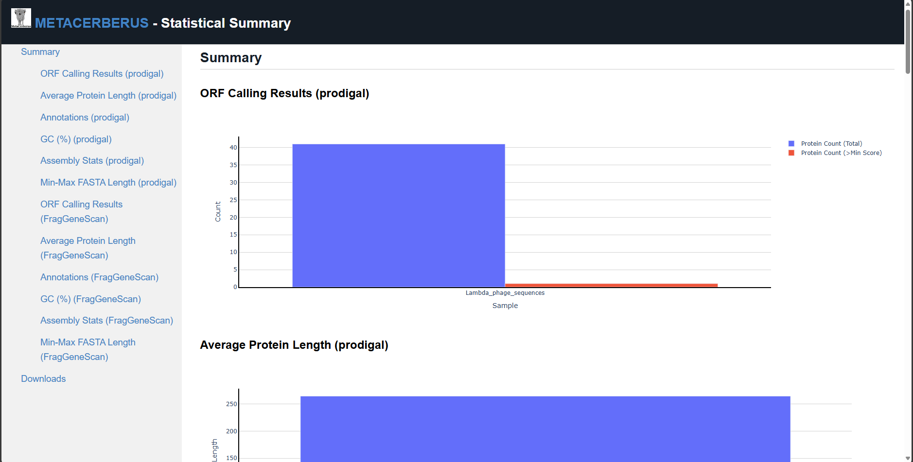

``stats.tsv``

.. image:: ../img/S10_Stats_tsv.jpg

``img`` --- contains the individual .png image files which are collectively located in ``stats.html``

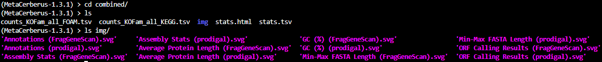

Final
-------------------
The contents of ``final`` are:

.. image:: ../img/Final_contents.jpg

`` ``
    .. image::